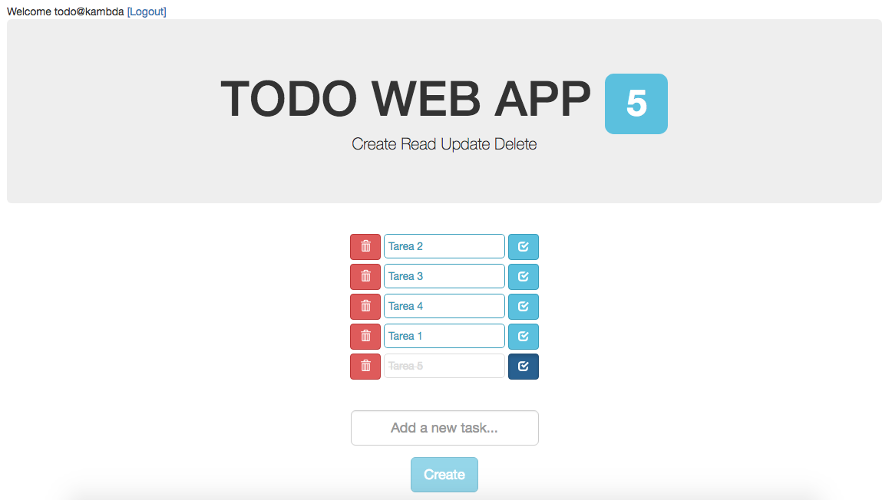

## Synopsis
 
A TODO APP with PostgreSQL that uses $HTTP service with verbs post, get, put and delete.

- Built with NodeJS, ExpressJS, AngularJS, PostgreSQL, Sequelize and localStorage

Node/Express provides the RESTful API through which the PostgreSQL database is queried. 

Based on Michael Cullen Todo (https://github.com/mick26/CRUD-todo-Node-Exp-ng-PostgreSQL)

# Requirements

* Node
* PostgreSQL database running on port 5432. A database needs to be created running .sql file from sql/database.sql in your Postgres database. 

## Installation

* Clone the Repository
* _npm install_ - install all the node packages listed in the package.json file 
* _bower install_ - installs the front end packages listed in the bower.json file

* Open ../sql/database.sql and run it in your Postgres database (You may have to change the Owner data on it)
* Open ../server/config/database.js and enter PostgreSQL database connection details, using this format: user@server:port/database

## Then Run

* _node server.js_
* Browse to _http://localhost:3090_

## Login data

* Username: todo@kambda
* Password: pass

## Screen Shot

		

Andrés Contreras
2017
